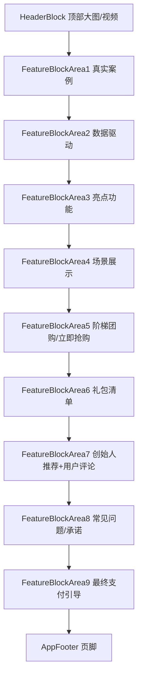

# 决胜单AI决策前端项目

使用cursor创建基本框架

## 技术栈（详细说明）
- **Vue.js 2.x**  
  使用 Vue 2.x 版本，采用单文件组件（SFC）开发，组件化结构清晰，便于维护和扩展。
- **Vue CLI**  
  推荐使用 vue-cli 3.x/4.x 脚手架进行项目初始化和本地开发。
- **JavaScript (ES6+)**  
  主要业务逻辑与交互均采用现代 JavaScript 语法实现。
- **SCSS/CSS**  
  组件内使用 scoped CSS，部分全局样式采用 SCSS 预处理，支持嵌套、变量、响应式媒体查询。
- **响应式设计**  
  通过媒体查询（max-width: 600px/900px）实现移动端、平板、桌面端自适应布局，兼容主流浏览器和设备。
- **动画与交互**  
  使用 CSS3 动画（如 keyframes、transition）、Vue 过渡（transition/transition-group）实现按钮动效、卡片hover、淡入淡出、弹窗等流畅交互。
- **Mermaid 流程图**  
  文档内用 Mermaid 语法描述页面结构和流程。
- **目录结构**
  ```
  vue2-app/
    ├── src/
    │   ├── components/   # 所有页面区块组件（FeatureBlockAreaX、HeaderBlock、AppFooter等）
    │   ├── App.vue       # 根组件，负责整体布局
    │   ├── main.js       # 入口文件
    │   └── css/          # （如有）全局样式/重置样式
    ├── public/           # 静态资源（图片、视频、favicon等）
    ├── package.json      # 依赖与脚本
    └── README.md         # 项目说明文档
  ```
- **兼容性**  
  兼容 Chrome、Safari、Edge、Firefox 等现代浏览器，移动端适配主流机型。

## 启动项目
1. 安装依赖（如有 package.json，使用 `npm install` 或 `yarn`）
2. 启动开发服务器：
   ```bash
   npm run serve
   # 或
   yarn serve
   ```
3. 浏览器访问 http://localhost:8080

> 如无 package.json，请用任意支持 Vue2 的脚手架（如 vue-cli）新建项目，将 src 目录内容覆盖即可。

## 页面结构流程图


---
如需二次开发或部署，建议使用 Node.js 16+，并确保本地有 npm/yarn 环境。 

---

## 你还缺少的关键内容

1. **gh-pages 依赖包**  
   用于自动将 `dist` 目录推送到 `gh-pages` 分支，实现在线 demo。

2. **package.json scripts 增加 deploy 命令**  
   方便一键部署到 GitHub Pages。

3. **vite.config.js 的 base 路径**  
   需设置为你的仓库路径（如 `/juehsengdan/vue2-app/`），否则资源会 404。

---

## 你需要的操作

1. 安装 gh-pages 依赖（只需一次）：
   ```bash
   npm install -D gh-pages
   ```

2. 修改 `package.json`，在 scripts 增加：
   ```json
   "deploy": "gh-pages -d dist"
   ```

3. 修改 `vite.config.js`，设置 base 路径为你的 GitHub Pages 子目录：
   ```js
   base: '/juehsengdan/vue2-app/'
   ```

4. 修改 `index.html`，入口脚本用相对路径：
   ```html
   <script type="module" src="./src/main.js"></script>
   ```

---

如需我帮你自动补全这些内容，请回复“继续”！ 